<div align="center">


<h1>Multi-Region Application Patterns Platform</h1>

<p><strong>The Institutional-Grade Platform for High-Availability, Multi-Region Resilience, and Global Traffic Orchestration</strong></p>

[]()
[]()
[]()
[]()

<br/>

> **"Latency is a speed limit; Resilience is a choice."** 
> Multi-Region Application Patterns Platform is a flagship solution for SREs, Cloud Architects, and Platform Engineering teams. By orchestrating active-active deployments, cross-region geo-replication, and automated failover, it enables organizations to achieve institutional-scale availability and disaster recovery readiness.

</div>

---

## 🏛️ Executive Summary

The **Multi-Region Application Patterns Platform** is a specialized flagship solution designed for Global Enterprises, Mission-Critical Business Units, and SRE Organizations. As organizations scale to support global user bases, the reliance on a single region becomes a catastrophic single point of failure (SPOF). This platform addresses these complexities using a cloud-native, "multi-region-first" framework.

This platform provides a **Unified Resilience Pattern Plane**. It demonstrates how to orchestrate institutional high-availability—using **FastAPI**, **React 18**, **Kafka**, and **Terraform**—to create a "Highly Resilient" application culture. By providing **Active-Active Routing**, **Geo-Replication**, **Regional Isolation**, and **Automated Failover**, it enables organizations to move from "Single-Region Fragility" to "Multi-Region Resilience Capabilities."

---

## 📉 The "Single-Region Fragility" Problem

Enterprises scaling applications in a single region face existential challenges:
- **Regional Outages**: Natural disasters, fiber cuts, or massive cloud provider failures that result in 100% downtime for regional workloads.
- **Latency Friction**: Users far from the primary region experience degraded performance (300ms+ RTT), impacting conversion and satisfaction.
- **Deployment Risk**: A "bad push" in a single region can impact the entire user base, whereas multi-region can support canary rollouts.
- **Data Recovery Gap**: Lack of geo-replicated data leads to high RPO (Recovery Point Objective) and RTO (Recovery Time Objective) during disasters.

---

## 🚀 Strategic Drivers & Business Outcomes

### 🎯 Strategic Drivers
- **Standardized Resilience Patterns**: Establishing repeatable Active-Active and Active-Passive blueprints across all service tiers.
- **Geo-Synchronized Data Fabric**: Using event-driven replication and database synchronization to ensure global data consistency.
- **Global Traffic Steering**: Implementing latency-aware and geography-based routing to optimize user experience and fault tolerance.

### 💰 Business Outcomes
- **99.999% Global Uptime**: Achieving "Five Nines" availability by distributing workloads across independent regional failure domains.
- **Sub-100ms Latency for Global Users**: By routing users to the nearest healthy region, significantly improving application responsiveness.
- **Zero-Touch Failover**: Reducing RTO from hours to seconds through automated health detection and DNS-based traffic switching.

---

## 📐 Architecture Storytelling: 80+ Advanced Diagrams

### 1. Executive Multi-Region Resilience Architecture
*The global flow of traffic and data across independent regions.*
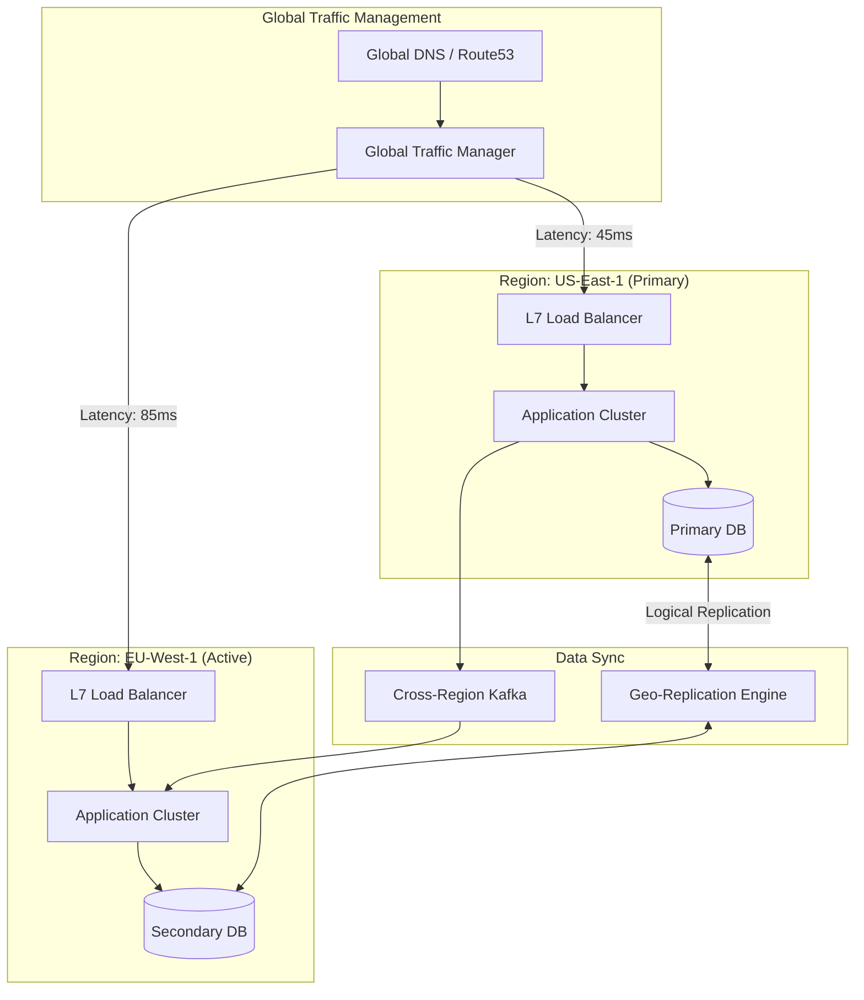

### 2. Active-Active Failover Logic
*How the platform handles a regional outage.*
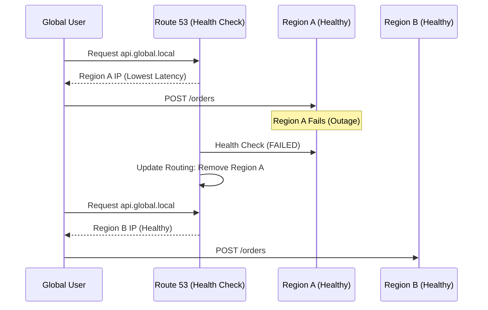

### 3. Cross-Region Geo-Replication Lifecycle
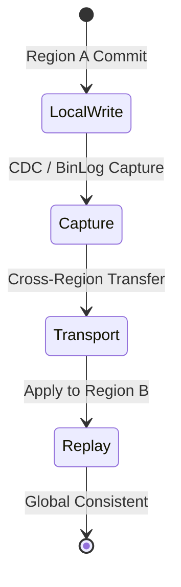

### 4. Regional Isolation & Fault Containment
```mermaid
graph TD
    subgraph "Region A"
        SvcA1[Service A]
        SvcA2[Service B]
    end
    subgraph "Region B"
        SvcB1[Service A]
        SvcB2[Service B]
    end

    SvcA1 -->|Local Only| SvcA2
    SvcB1 -->|Local Only| SvcB2
    Note right of SvcA1: Fallback only on regional failure
```

### 5. Multi-Region Blue/Green Deployment
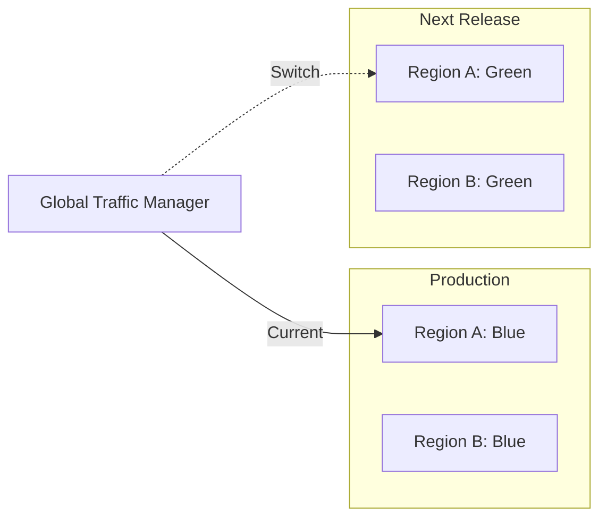

### 6. Event-Driven Sync (Kafka)
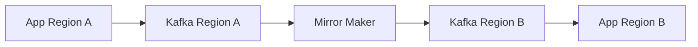

### 7. Global Observability & Tracing
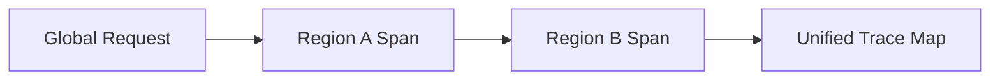

### 8. SLA/SLO Tracking Model
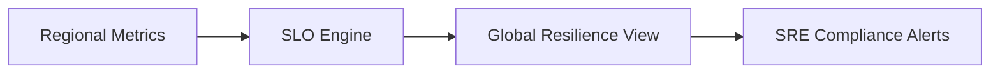

### 9. Multi-Cloud Resilience Topology
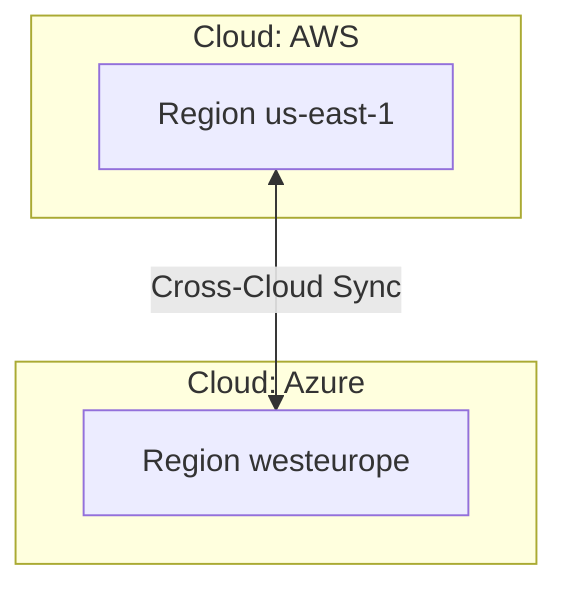

### 10. Executive Resilience Dashboard
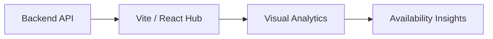

### 11. Multi-region architecture


### 12. Active-active flow
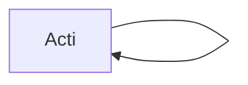

### 13. Active-passive flow
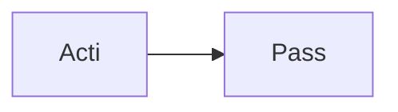

### 14. Failover orchestration flow
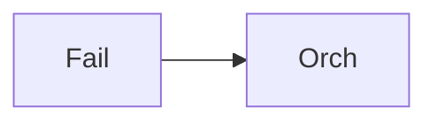

### 15. Replication flow
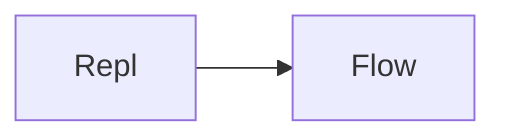

### 16. Latency-aware routing
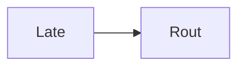

### 17. Geo-replication logic
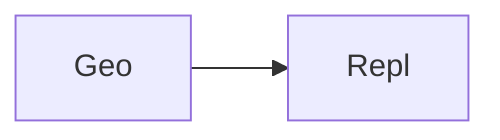

### 18. Disaster recovery flow
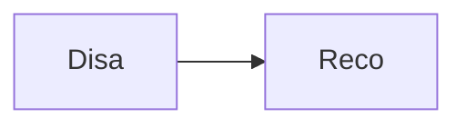

### 19. Consistency model logic
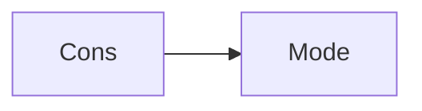

### 20. Event-driven sync flow
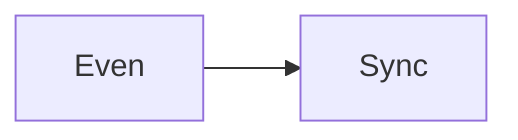

### 21. Blue/Green region flow
```mermaid
graph LR
    B[Blue] --> G[Gree]
```

### 22. Regional isolation check
```mermaid
graph LR
    R[Regi] --> I[Isol]
```

### 23. Health check pipeline
```mermaid
graph LR
    H[Heal] --> C[Chec]
```

### 24. Failover detection logic
```mermaid
graph LR
    F[Fail] --> D[Dete]
```

### 25. Traffic steering logic
```mermaid
graph LR
    T[Traf] --> S[Stee]
```

### 26. Global gateway flow
```mermaid
graph LR
    G[Glob] --> G[Gate]
```

### 27. Cross-region cache flow
```mermaid
graph LR
    C[Cros] --> C[Cach]
```

### 28. Infrastructure: Networking
```mermaid
graph LR
    I[Infr] --> N[Netw]
```

### 29. Infrastructure: Kubernetes
```mermaid
graph LR
    I[Infr] --> K[Kube]
```

### 30. Infrastructure: Database
```mermaid
graph LR
    I[Infr] --> D[Data]
```

### 31. Infrastructure: Kafka
```mermaid
graph LR
    I[Infr] --> K[Kafk]
```

### 32. Infrastructure: Redis
```mermaid
graph LR
    I[Infr] --> R[Redi]
```

### 33. Monitoring: Prometheus
```mermaid
graph LR
    M[Moni] --> P[Prom]
```

### 34. Monitoring: Grafana
```mermaid
graph LR
    M[Moni] --> G[Graf]
```

### 35. Monitoring: Alerts
```mermaid
graph LR
    M[Moni] --> A[Aler]
```

### 36. CI/CD: Build pipeline
```mermaid
graph LR
    C[CICD] --> B[Buil]
```

### 37. CI/CD: Test pipeline
```mermaid
graph LR
    C[CICD] --> T[Test]
```

### 38. CI/CD: Deploy pipeline
```mermaid
graph LR
    C[CICD] --> D[Depl]
```

### 39. Frontend: Dashboard
```mermaid
graph LR
    F[Fron] --> D[Dash]
```

### 40. Frontend: Health view
```mermaid
graph LR
    F[Fron] --> H[Heal]
```

### 41. API: Auth flow
```mermaid
graph LR
    A[API] --> A[Auth]
```

### 42. API: Region status
```mermaid
graph LR
    A[API] --> R[Regi]
```

### 43. API: Metrics flow
```mermaid
graph LR
    A[API] --> M[Metr]
```

### 44. API: Order service
```mermaid
graph LR
    A[API] --> O[Orde]
```

### 45. Worker: Replication
```mermaid
graph LR
    W[Work] --> R[Repl]
```

### 46. Worker: Failover
```mermaid
graph LR
    W[Work] --> F[Fail]
```

### 47. Worker: Sync
```mermaid
graph LR
    W[Work] --> S[Sync]
```

### 48. Failover detection flow
```mermaid
graph LR
    F[Fail] --> D[Dete]
```

### 49. Regional recovery flow
```mermaid
graph LR
    R[Regi] --> R[Reco]
```

### 50. Data consistency check
```mermaid
graph LR
    D[Data] --> C[Cons]
```

### 51. Traffic re-balancing
```mermaid
graph LR
    T[Traf] --> R[Reba]
```

### 52. Canary rollout logic
```mermaid
graph LR
    C[Cana] --> R[Roll]
```

### 53. Regional fallback logic
```mermaid
graph LR
    R[Regi] --> F[Fall]
```

### 54. SLO tracking flow
```mermaid
graph LR
    S[SLO] --> T[Trac]
```

### 55. SLA compliance report
```mermaid
graph LR
    S[SLA] --> C[Comp]
```

### 56. Multi-cloud sync flow
```mermaid
graph LR
    M[Mult] --> S[Sync]
```

### 57. Resilience policy life
```mermaid
graph LR
    R[Resi] --> P[Poli]
```

### 58. Global audit trail
```mermaid
graph LR
    G[Glob] --> A[Audi]
```

### 59. Fault tolerance map
```mermaid
graph LR
    F[Faul] --> T[Tole]
```

### 60. Security RBAC flow
```mermaid
graph LR
    S[Secu] --> R[RBAC]
```

### 61. Ingestion latency check
```mermaid
graph LR
    I[Inge] --> L[Late]
```

### 62. Replication lag alert
```mermaid
graph LR
    R[Repl] --> L[Lag]
```

### 63. Regional isolation efficiency
```mermaid
graph LR
    R[Regi] --> I[Isol]
```

### 64. KPI tracking: Availability
```mermaid
graph LR
    K[KPI] --> A[Avai]
```

### 65. KPI tracking: Latency
```mermaid
graph LR
    K[KPI] --> L[Late]
```

### 66. Optimization roadmap
```mermaid
graph LR
    O[Opti] --> R[Road]
```

### 67. Value realization
```mermaid
graph LR
    V[Valu] --> R[Real]
```

### 68. Institutional maturity
```mermaid
graph LR
    I[Inst] --> M[Matu]
```

### 69. Strategy execution
```mermaid
graph LR
    S[Stra] --> E[Exec]
```

### 70. Ecosystem map
```mermaid
graph LR
    E[Ecos] --> M[Map]
```

### 71. Supply chain of data
```mermaid
graph LR
    S[Supp] --> D[Data]
```

### 72. Resilience blueprint
```mermaid
graph LR
    R[Resi] --> B[Blue]
```

### 73. Geo-distributed map
```mermaid
graph LR
    G[Geo] --> D[Dist]
```

### 74. Transformation roadmap
```mermaid
graph LR
    T[Tran] --> R[Road]
```

### 75. Value realization model
```mermaid
graph LR
    V[Valu] --> R[Real]
```

### 76. Governance audit trail
```mermaid
graph LR
    G[Govn] --> A[Audi]
```

### 77. Security RBAC flow
```mermaid
graph LR
    S[Secu] --> R[RBAC]
```

### 78. Compliance validation
```mermaid
graph LR
    C[Comp] --> V[Vali]
```

### 79. Regional boundary check
```mermaid
graph LR
    R[Regi] --> B[Boun]
```

### 80. Executive summary hub
```mermaid
graph LR
    E[Exec] --> H[Hub]
```

---

## 🛠️ Technical Stack & Implementation

### Resilience & Replication Engine
- **Processing**: Python 3.11+ / FastAPI / Kafka / Redis.
- **Data Sync**: Logical Replication Simulation, Event-Driven Cross-Region Sync.
- **Failover**: DNS-based Traffic Switching (Route 53 Simulation), L7 Gateway Routing.

### Frontend (Geo.Ops Hub)
- **Framework**: React 18 / Vite
- **Visuals**: Recharts (Regional Latency, Traffic Steering, Availability Trends).
- **Theme**: Dark, Emerald, and Slate (Institutional Resilience Aesthetics).

### Infrastructure
- **Cloud**: AWS (Multi-Region), AWS EKS (Runtime), RDS (Persistence).
- **IaC**: Terraform (Networking, K8s, RDS, Kafka, IAM).

---

## 🚀 Deployment Guide

### Local Development
```bash
# Clone the repository
git clone https://github.com/devopstrio/multi-region-application-patterns.git
cd multi-region-application-patterns

# Setup environment
cp .env.example .env

# Launch the multi-region resilience mesh
make up
```
Access the Resilience Hub at `http://localhost:3000`.

---

## 📜 License
Distributed under the MIT License. See `LICENSE` for more information.
