<div align="center">


<h1>Multi-Region Application Patterns</h1>

<p><strong>The Institutional-Grade Platform for High-Availability, Multi-Region Resilience, and Global Traffic Orchestration.</strong></p>

[]()
[]()
[]()

<br/>

> **"Latency is a speed limit; Resilience is a choice."** 
> **Multi-Region Application Patterns** is an enterprise-grade platform designed to provide a secure, measurable, and highly automated foundation for global application availability. It orchestrates the complex lifecycle of multi-region infrastructure—from active-active traffic steering and cross-region data replication to automated failover and unified resiliency governance.

</div>

---

## 🏛️ Executive Summary

Single-region application footprints and manual disaster recovery procedures are strategic operational liabilities; lack of centralized multi-region orchestration is a primary barrier to organizational reliability. Organizations fail to achieve "Five Nines" availability not because of a lack of servers, but because of fragmented resiliency standards, lack of automated data replication, and an inability to orchestrate regional failover with operational precision.

This platform provides the **Resiliency Intelligence Plane**. It implements a complete **Enterprise Resiliency-as-Code Framework**, enabling SRE and Platform teams to manage global availability as a first-class citizen. By automating the deployment of geographically distributed workloads and orchestrating real-time traffic steering, we ensure that every organizational asset—from public-facing e-commerce portals to backend financial ledger systems—is resilient by default, audited for history, and strictly aligned with institutional disaster recovery frameworks.

---

## 📐 Architecture Storytelling: Principal Reference Models

### 1. Principal Architecture: Global Multi-Region Availability & Resiliency Intelligence Plane
This diagram illustrates the end-to-end flow from global traffic steering and multi-region provisioning to cross-region data replication, failover orchestration, and institutional resiliency auditing.

```mermaid
graph LR
    %% Subgraph Definitions
    subgraph TrafficManagement["Global Traffic Steering"]
        direction TB
        GSLB["Global Load Balancer (Route53/FrontDoor)"]
        WAF["Global WAF Edge"]
        CDN["Edge Content Delivery (CloudFront)"]
    end

    subgraph IntelligenceEngine["Resiliency Intelligence Hub"]
        direction TB
        API["FastAPI Resilience Gateway"]
        Replicator["Data Replication Orchestrator"]
        FailoverMgr["Failover & Health Manager"]
        Consistency["Global Consistency Validator"]
    end

    subgraph RegionalClusters["Multi-Region Execution Fleet"]
        direction TB
        RegionA["Region A (Active) - EKS"]
        RegionB["Region B (Active) - EKS"]
        RegionC["Region C (Passive/DR) - EKS"]
    end

    subgraph OperationsHub["Institutional Resiliency Hub"]
        direction TB
        Scorecard["Resiliency Maturity Score"]
        Analytics["Latency & Availability Stats"]
        Audit["Forensic Resiliency Metadata Lake"]
    end

    subgraph DevOps["Resiliency-as-Code Orchestration"]
        direction TB
        TF["Terraform Multi-Region Modules"]
        Chaos["Chaos Engineering Engine"]
        ChatOps["Failover Approval Hub"]
    end

    %% Flow Arrows
    TrafficManagement -->|1. Route User| RegionalClusters
    RegionalClusters -->|2. Sync Data| Replicator
    Replicator -->|3. Validate Consistency| Consistency
    FailoverMgr -->|4. Monitor Health| RegionalClusters
    
    FailoverMgr -->|5. Trigger Failover| GSLB
    API -->|6. Visualize Health| Scorecard
    Scorecard -->|7. Track RTO/RPO| Analytics
    Scorecard -->|8. Record Event| Audit
    
    TF -->|9. Provision Regions| IntelligenceEngine
    Chaos -->|10. Simulate Outage| RegionalClusters
    ChatOps -->|11. Approve Recovery| FailoverMgr
    Audit -->|12. Improve Models| FailoverMgr

    %% Styling
    classDef traffic fill:#f5f5f5,stroke:#616161,stroke-width:2px;
    classDef intel fill:#e8f5e9,stroke:#1b5e20,stroke-width:2px;
    classDef regional fill:#e1f5fe,stroke:#01579b,stroke-width:2px;
    classDef ops fill:#ede7f6,stroke:#311b92,stroke-width:2px;
    classDef devops fill:#fffde7,stroke:#f57f17,stroke-width:2px;

    class TrafficManagement traffic;
    class IntelligenceEngine intel;
    class RegionalClusters regional;
    class OperationsHub ops;
    class DevOps devops;
```

### 2. The Multi-Region Lifecycle Flow
The continuous path of a multi-region application from initial design and provisioning to active replication, failover, and institutional forensic auditing.

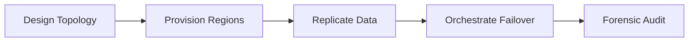

### 3. Active-Active Global Traffic Steering Topology
Utilizing Global Server Load Balancers (GSLB) to distribute traffic across multiple active regions based on proximity, health, and regional capacity, ensuring the lowest possible latency for global users.

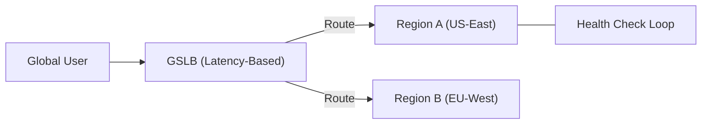

### 4. Active-Passive Disaster Recovery Flow
Orchestrating the transition of traffic from a primary region to a secondary/DR region during a catastrophic failure, while maintaining strict RPO/RTO targets for data consistency.

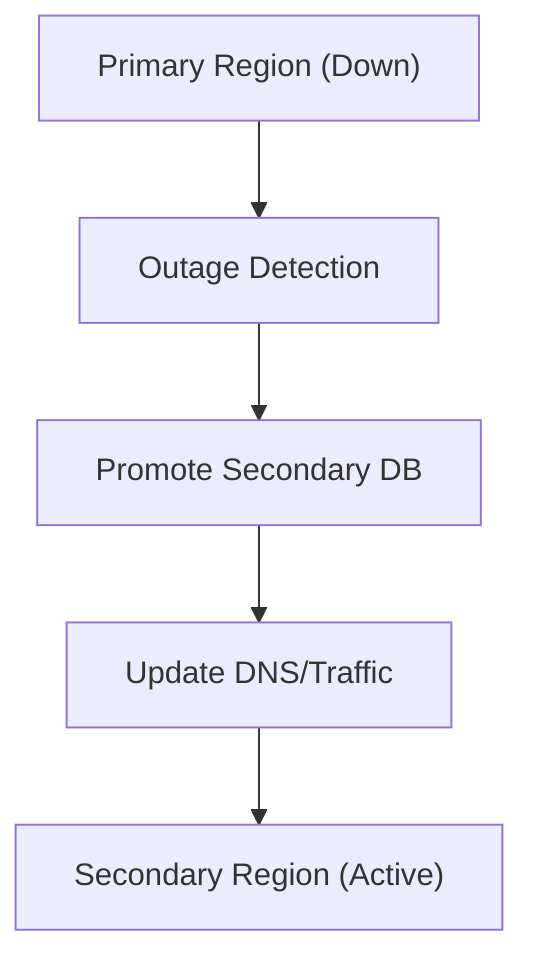

### 5. Multi-Region Data Replication Strategy
Implementing a robust data fabric using asynchronous and synchronous replication (e.g., Aurora Global Database, Cosmos DB) to ensure data is available across geographic boundaries.

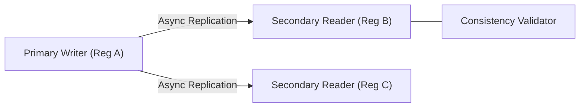

### 6. Global Content Delivery & Edge Logic Flow
Leveraging Content Delivery Networks (CDNs) and Edge Computing (e.g., CloudFront Functions, Lambda@Edge) to offload regional backends and serve static/dynamic content closer to the user.

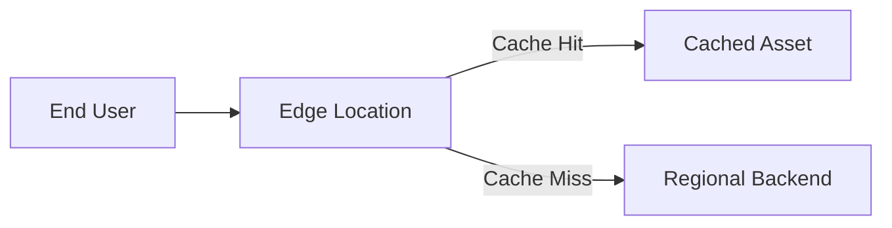

### 7. Institutional Resiliency Scorecard
Grading organizational performance based on key indicators: Recovery Time Objective (RTO), Recovery Point Objective (RPO), and Regional Failure Isolation.

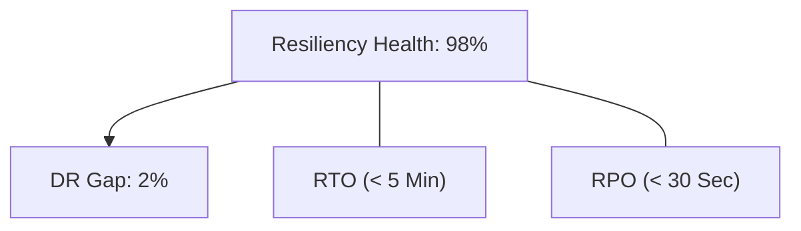

### 8. Identity & RBAC for Global Ops Governance
Managing fine-grained access to regional failover triggers, replication policies, and global traffic maps between Global SREs, Regional Admins, and DR Coordinators.

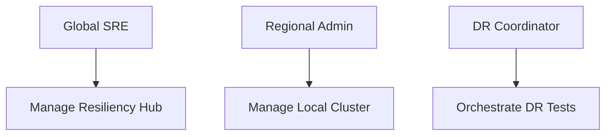

### 9. IaC Deployment: Resiliency-as-Code Framework
Using modular Terraform to deploy and manage the versioned distribution of the multi-region hubs, cluster fleets, and forensic metadata lakes.

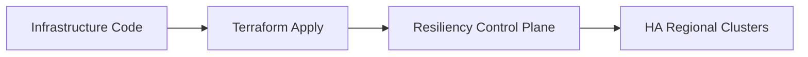

### 10. Chaos Engineering & Regional Partition Flow
Testing the effectiveness of regional failover by injecting controlled failures, such as network partitions or regional API blackouts, to validate the autonomous recovery capabilities of the platform.

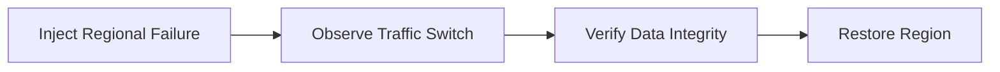

### 11. Metadata Lake for Forensic Resiliency Audit
Storing long-term records of every regional failover, replication event, and health check result for institutional record-keeping, compliance auditing, and post-incident investigation.

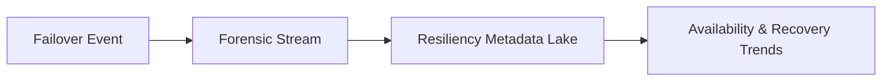

---

## 🏛️ Core Resiliency Pillars

1.  **Active-Active Traffic Orchestration**: Eliminating single-region SPOFs through global load balancing.
2.  **Cross-Region Data Synchronization**: Ensuring global data availability through managed geo-replication.
3.  **Autonomous Failover & Recovery**: Reducing RTO through automated health detection and traffic steering.
4.  **Regional Failure Isolation**: Hard-fencing regional environments to prevent cascading failures across the globe.
5.  **Chaos-Tested Reliability**: Validating resiliency posture through continuous regional failure injection.
6.  **Full Resiliency Auditability**: Immutable recording of every regional event and failover decision for institutional forensics.

---

## 🛠️ Technical Stack & Implementation

### Resiliency Engine & APIs
*   **Framework**: Python 3.11+ / FastAPI.
*   **Replication Core**: Native integration with Aurora Global, Cosmos DB, and Multi-Region S3.
*   **Failover Hub**: Orchestration of AWS Route 53, Azure Front Door, and GCP Global Load Balancer.
*   **Persistence**: PostgreSQL (Metadata Lake) and Redis (Live Health Cache).
*   **Auth Orchestrator**: Federated OIDC/SAML for least-privilege resiliency management access.

### Resiliency Dashboard (UI)
*   **Framework**: React 18 / Vite.
*   **Theme**: Dark, Emerald, Slate (Modern high-fidelity operational aesthetic).
*   **Visualization**: D3.js for global traffic maps and Recharts for regional availability trends.

### Infrastructure & DevOps
*   **Runtime**: AWS EKS or Azure Kubernetes Service (AKS) across multiple regions.
*   **Connectivity**: Dedicated inter-region peering and global VPC/VNet backbones.
*   **IaC**: Modular Terraform for deploying the multi-region hub and regional cluster distributions.

---

## 🏗️ IaC Mapping (Module Structure)

| Module | Purpose | Real Services |
| :--- | :--- | :--- |
| **`infrastructure/resi_hub`** | Central management plane | EKS, PostgreSQL, Redis |
| **`infrastructure/regions`** | Regional cluster templates | EKS, RDS, VPC |
| **`infrastructure/traffic`** | Global load balancing | Route53, Front Door |
| **`infrastructure/auditing`** | Forensic resiliency sinks | S3, Athena, Quicksight |

---

## 🚀 Deployment Guide

### Local Principal Environment
```bash
# Clone the resiliency platform
git clone https://github.com/devopstrio/multi-region-application-patterns.git
cd multi-region-application-patterns

# Configure environment
cp .env.example .env

# Launch the Resiliency stack
make init

# Trigger a mock multi-region failover and data replication simulation
make simulate-failover
```

Access the Resilience Hub at `http://localhost:3000`.

---

## 📜 License
Distributed under the MIT License. See `LICENSE` for more information.

---
<div align="center">
  <p>© 2026 Devopstrio. All rights reserved.</p>
</div>
