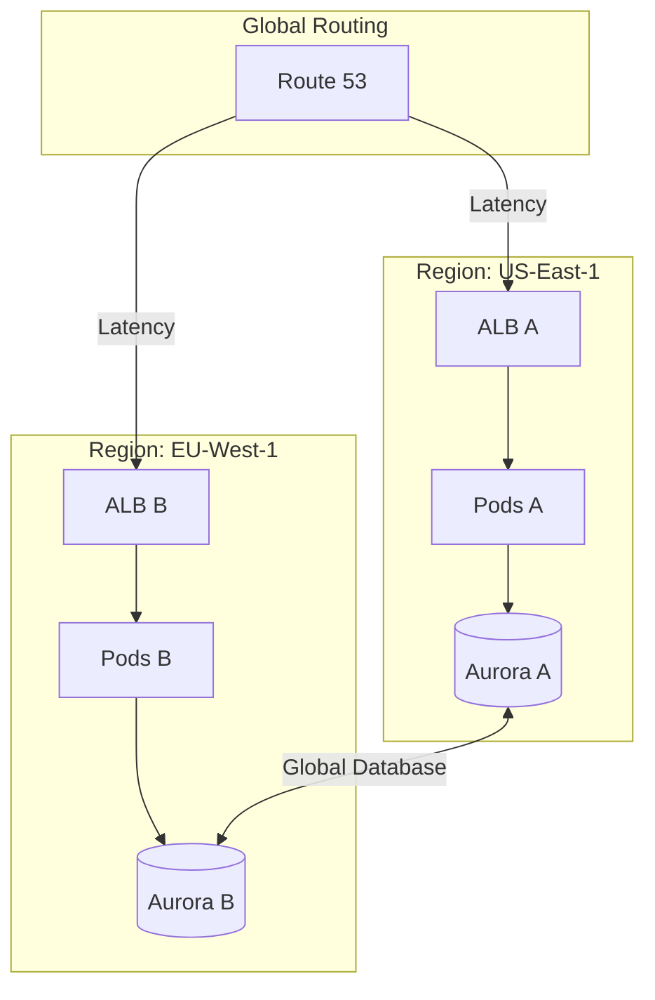
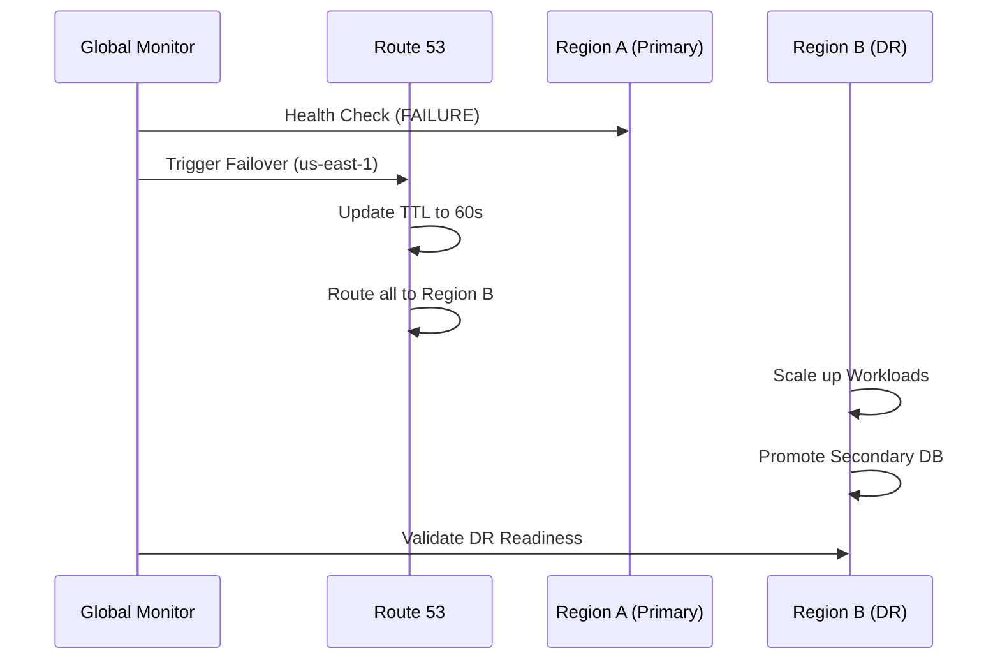
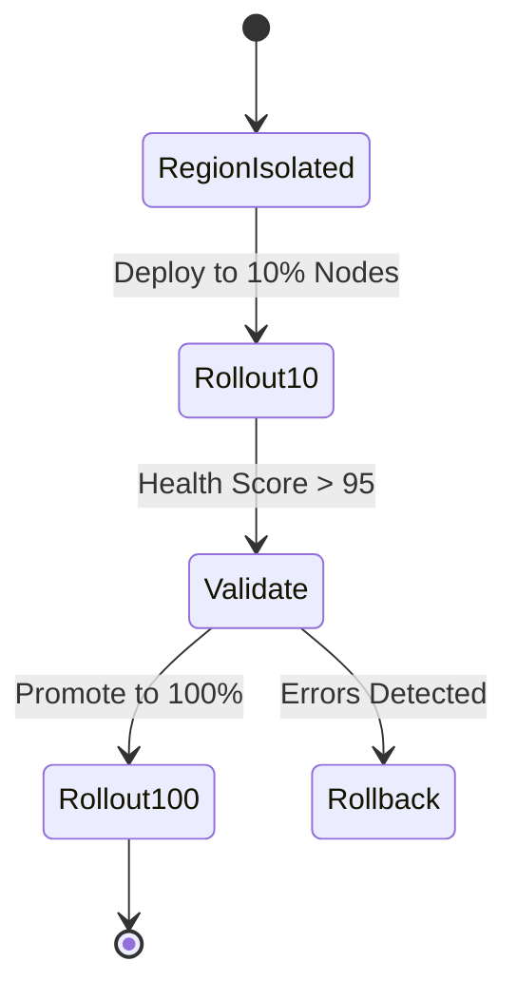

# Architecture & Topology Diagrams

## 31. Multi-Region Active-Active Topology

```mermaid
graph TD
    subgraph "Region: US-East-1"
        LBA[ALB A] --> AppA[Pods A]
        AppA --> DBA[(Aurora A)]
    end
    subgraph "Region: EU-West-1"
        LBB[ALB B] --> AppB[Pods B]
        AppB --> DBB[(Aurora B)]
    end
    subgraph "Global Routing"
        R53[Route 53]
    end

    R53 -->|Latency| LBA
    R53 -->|Latency| LBB
    DBA <-->|Global Database| DBB
```

## 40. Automated Disaster Recovery Flow

```mermaid
sequenceDiagram
    participant Mon as Global Monitor
    participant DNS as Route 53
    participant RegA as Region A (Primary)
    participant RegB as Region B (DR)

    Mon->>RegA: Health Check (FAILURE)
    Mon->>DNS: Trigger Failover (us-east-1)
    DNS->>DNS: Update TTL to 60s
    DNS->>DNS: Route all to Region B
    RegB->>RegB: Scale up Workloads
    RegB->>RegB: Promote Secondary DB
    Mon->>RegB: Validate DR Readiness
```

## 50. Regional Canary Rollout Flow

```mermaid
stateDiagram-v2
    [*] --> RegionIsolated
    RegionIsolated --> Rollout10: Deploy to 10% Nodes
    Rollout10 --> Validate: Health Score > 95
    Validate --> Rollout100: Promote to 100%
    Validate --> Rollback: Errors Detected
    Rollout100 --> [*]
```
