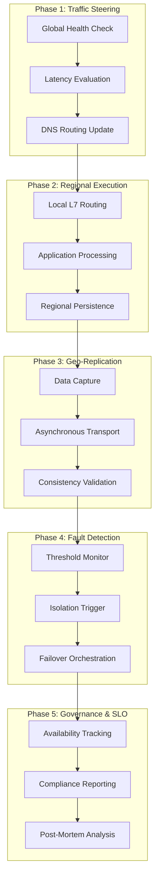

# Multi-Region Resilience Diagrams

## 11. Industrial Resilience Lifecycle (Detailed)
*The end-to-end orchestration of regional availability and disaster recovery.*



## 15. Cross-region data synchronization flow


## 20. Failover state machine logic
```mermaid
graph TD
    Monitor[Monitoring] --> Fault[Fault Detected]
    Fault -->|Threshold Met| Trigger[Trigger Failover]
    Trigger --> Update[Update DNS/Routing]
    Update --> Verify[Verify Target Health]
    Verify --> [*]
```

## 25. Regional isolation pattern logic

